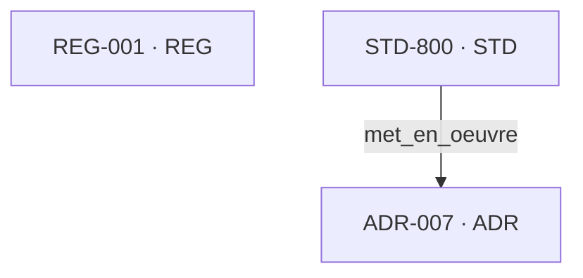

# Vue d’architecture du MAD Registry — P4.3

> Généré automatiquement à partir de `registry-index.yaml`. Ne pas modifier manuellement.

## Synthèse architecturale

- Objets : **3**
- Relations : **1**
- Racines : **1**
- Feuilles : **1**
- Hubs : **0**
- Objets isolés : **1**
- Cycles détectés : **0**
- Références cassées : **0**
- Profondeur maximale observée : **1**

## Graphe logique

## Objets structurants

- Racines : `STD-800`
- Feuilles : `ADR-007`
- Hubs : Aucun
- Isolés : `REG-001`

## Niveaux architecturaux calculés

| Niveau | Objets |
|---:|---|
| 0 | `STD-800` |
| 1 | `ADR-007` |
| Isolé | `REG-001` |

## Dépendances par objet

| Objet | Niveau | Entrées | Sorties | Impact direct | Impact indirect |
|---|---:|---|---|---|---|
| `ADR-007` | 1 | `STD-800 (met_en_oeuvre)` | — | — | — |
| `REG-001` | Isolé | — | — | — | — |
| `STD-800` | 0 | — | `ADR-007 (met_en_oeuvre)` | `ADR-007` | — |

## Dette architecturale

- ⚠️ 1 objet(s) isolé(s) : `REG-001`.
- ✅ Aucun cycle détecté.
- ✅ Aucune référence cassée.

## Limites d’interprétation

- Les niveaux sont calculés depuis les racines observées; ils ne remplacent pas une taxonomie architecturale déclarée.
- Un hub est défini ici comme un objet ayant au moins trois relations entrantes et sortantes combinées.
- La carte d’impact suit uniquement les relations dirigées présentes dans le registre.
- Cette vue ne constitue ni un score MAD Health ni une recommandation automatique.